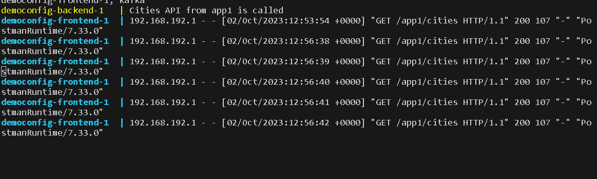
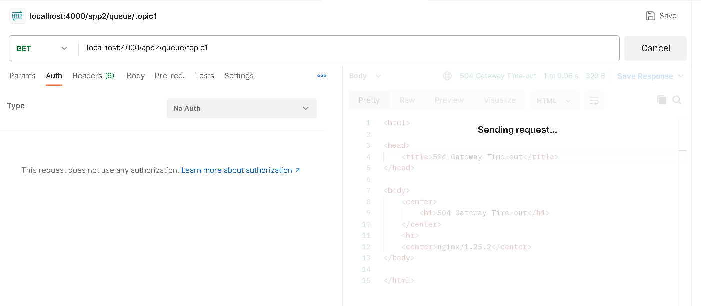

# Project description

This project is used to demonstrate how to use nginx as a reverse proxy and load balancer with caching ability, as well as how to use Kafka as a message broker within the dotnet apps. It consists of two dotnet Web Api projects. First project has one simple endpoint that return cities from an array. Second project has endpoints for creating Kafka topics, publishing messages and subscribing to those topics. Also, it is showcased how to start these features witin the docker containers.

# Nginx configuration

Nginx is configured in DemoConfig/nginx.conf file. It uses port 4000 and configures two locations app1 and app2 for already described apps. For app1 we configured load balancing upstreams and additionally, for app1, caching is configured. 

# Starting the project

Project can be started with Docker by running command: <strong>docker-compose up --scale backend=4</strong> from DemoConfig folder. /
We start 4 different containers for app1 (called backend in docker-compose file) to demonstrate load balancing ability. In docker-compose we expose port 4000 for nginx server.

# Examples
## Load balancing and caching

Here we are calling endpoint from app1. We can see the results and headers. After first call cache is missed end after second call onwards the cache is hit. In 4th picture we can see that nginx server called the endpoint only once. After we remove cache from config, we can see in 5th picure that all 4 containers (servers) are called in round robin fashion on every request as a load balancing technique.

 /
 /
 /
 /

## Kafka message broker

We enabled Kafka with app2 endpoints. First, let's create topic under a name "topic1". Then, we will post messages to topic "topic1". After that, we will subscribe to "topic1" and listen to messages. Of course, consumer service can be some third party app, but here we implemented producer and cosumer in the same app for convenience purposes.

 /
 /
 /
 /

 